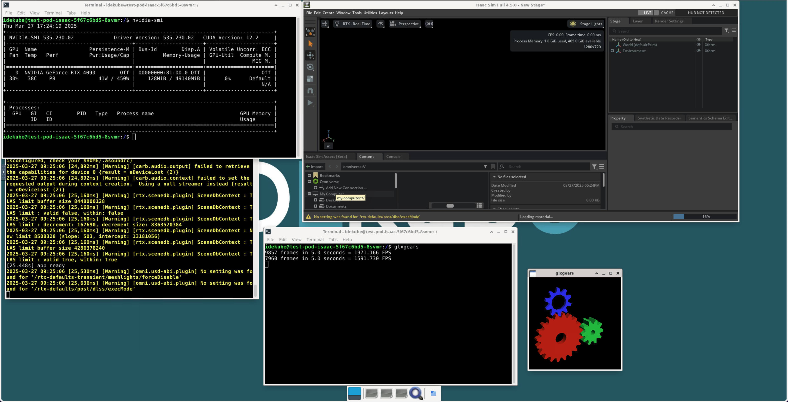

# idekube container

<div style="text-align: center;">
    
</div>
The IDEKUBE project was initiated to provide an IDE container, facilitating development work within Kubernetes clusters. This is a continuously updated collection of containers, primarily used in scenarios such as robotics, simulations, machine learning, and education. The project has been utilized in courses at the Shanghai Jiao Tong University Paris Elite Institute of Technology (SPEIT).

The project is divided into three branches: `coder` and `jupyter`, each offering IDE containers based on Coder and Jupyter respectively, and `featured`, which provides a desktop environment and Coder. All branches offer SSH support based on Websocat tunnels. All exposed services are reverse-proxied by the built-in Nginx on port 80 of the container, with the following endpoints:

| Endpoint           | Service                  |
| ------------------ | ------------------------ |
| `/coder/`          | Coder service            |
| `/jupyter/`        | Jupyter service          |
| `/vnc/`            | noVNC service            |
| `/vnc/websockify/` | noVNC websockify service |
| `/ssh`             | Websocat-proxied SSH     |

The desktop environment supports hardware acceleration based on EGL (using VirtualGL), thus eliminating the need for /tmp/.X11-unix mapping. When the container runs on an NVIDIA runtime, it should load NVIDIA's OpenGL libraries and enable hardware acceleration. If the container is not configured with a GPU, it will switch to software rendering mode. The container has been tested in Kubernetes clusters with `nvidia-device-plugin`, WSL, and `nvidia-container-toolkit`, an external display is not required.

The container supports architectures including `amd64` and `arm64`.

> Due to a lack of hardware, GPU hardware acceleration on the `arm64` architecture has not been tested.

## Get Started

This image is designed to be used in a Kubernetes cluster. The following is an example deployment for `k3s` and `nvidia-device-plugin` combo:

```yaml
apiVersion: apps/v1
kind: Deployment
metadata:
  name: test-pod
spec:
  replicas: 1
  selector:
    matchLabels:
      app: test-pod
  template:
    metadata:
      labels:
        app: test-pod
    spec:
      runtimeClassName: nvidia
      containers:
        - name: container-0
          image: docker.io/davidliyutong/idekube-container:featured-base-v0.3.1
          env:
            - name: NVIDIA_DRIVER_CAPABILITIES # For Vulkan, OpenGL, NVEncode, etc, avoid manually mapping libs.
              value: all
          ports:
            - containerPort: 80
              name: 80tcp
              protocol: TCP
          resources: # GPU allocation
            limits:
              nvidia.com/gpu: "1"
            requests:
              nvidia.com/gpu: "1"
          securityContext:
            allowPrivilegeEscalation: true
            privileged: false
          volumeMounts:
            - mountPath: /home/idekube
              name: your-volume
            - mountPath: /dev/shm # For deep learning frameworks, e.g. PyTorch
              name: shm-volume
      volumes:
        - name: your-volume # Use a volume claim for persistent storage
          persistentVolumeClaim:
            claimName: your-pvc
        - name: shm-volume
          emptyDir:
            medium: Memory
            sizeLimit: 256Mi
```

However, it can also be used as a standalone container. The following is an example docker-compose file:

```yaml
services:
  idekube_container:
    image: davidliyutong/idekube-container:coder-base-v0.3.1
    ports:
      - "3000:80"
    volumes:
      - idekube_volume:/home/idekube
      - <your_extra_data_path>:/mnt/data
    deploy:
      resources:
        reservations:
          devices:
            - driver: nvidia
              count: 1
              capabilities: ["gpu"]
    ipc: host

volumes:
  idekube_volume:
    driver: local
```

To run OpenGL applications in the container, you need to use `vglrun` from `VirtualGL`. For example

```shell
vglrun glxgears
```

You can monitor the CPU usage of the container with `htop`.

## Architecture Explained

There are three flavors: `featured` with noVNC support and `jupyter`/`coder` without noVNC support.

The container runs a `supervisord` process that starts services. A nginx server is used to reverse proxy the services.

The `artifacts/$flavor/startup.sh` script is used to start the container. It configure the container according to environment variables and starts the `supervisord` process.

| Name                      | Description                                     | Default     |
| ------------------------- | ----------------------------------------------- | ----------- |
| `IDEKUBE_INIT_HOME`       | any value if need to init home with /etc/skel/  | empty       |
| `IDEKUBE_PREFERED_SHELL`  | path to shell                                   | `/bin/bash` |
| `IDEKUBE_AUTHORIZED_KEYS` | base64 encoded authorized keys                  | `""`        |
| `I_AM_INIT_CONTAINER`     | any value if the container is an init container | empty       |

> If running with url prefix `IDEKUBE_INGRESS_PATH`, please use ingress re-write rules to strip the prefix. Direct support for `IDEKUBE_INGRESS_PATH` has been removed to simplify the codebase.

### Special Environment `I_AM_INIT_CONTAINER`

If the environment variable `I_AM_INIT_CONTAINER` is set, the container will detect if `/rootfs` is an external mount. If so, it will copy the `/` over to `/rootfs`, excluding certain directories.

### Special Directory `/rootfs`

If the directory `/rootfs` exists and is mounted from the host, the container will chroot into it and run the services there.

> This feature requires the container to run in `privileged` mode.

## Usage

| URL/CMD                                                                                               | Service              | Note                      |
| ----------------------------------------------------------------------------------------------------- | -------------------- | ------------------------- |
| `$SCHEME://INGRESS_HOST$/coder/`                                                  | Coder service        | tailing slash is required |
| `$SCHEME://INGRESS_HOST$/jupyter/`                                                | Jupyter service      | tailing slash is required |
| `$SCHEME://INGRESS_HOST$/novnc/`                                                  | noVNC service        | tailing slash is required |
| `ssh -o ProxyCommand="websocat --binary ws://INGRESS_HOST$/ssh/" idekube@idekube` | Websocat-proxied SSH |                           |

### SSH Proxy

You can also use this ssh config snippet:

```ssh-config
Host idekube
  User idekube
  ProxyCommand websocat --binary ws://$INGRESS_HOST$/ssh/
```

> If you have SSL enabled, you can use `wss` instead of `ws`.

### Build Sysetem

The project use Makefile to build the container. A script `scripts/shell/build_image.sh` is used to parse `.dockerargs` file and generate docker build arguments. Image produced are taged as `$REGISTRY/$AUTHOR/$NAME:$BRANCH-$ARCH` etc. Mutli-arch build is supported with `docker buildx` via `scripts/shell/buildx_image.sh`.

## Build the container

First use `make pull_deps` to pull the dependencies.

Set `BRANCH` to the branch you want to build (e.g. featured/base), then use`make build` to build native image and `make buildx` to build the container for multi-arch.

> Use `make buildx_all` to build all branches sequentially.

### Build Stage Variables

You can configure environment variables to control the build process. The following variables are available:

| Name             | Description                                          | Default               |
| ---------------- | ---------------------------------------------------- | --------------------- |
| `REGISTRY`       | The registry to push the image to.                   | `"docker.io"`         |
| `AUTHOR`         | The username for the registry. Also the project name | `"davidliyutong"`     |
| `NAME`           | The project name                                     | `"idekube-container"` |
| `USE_APT_MIRROR` | Use apt mirror for faster build if set to `true`     | `false`               |
| `APT_MIRROR`     | The apt mirror to use                                | `""`                  |
| `USE_PIP_MIRROR` | Use pypi mirror for faster build if set to `true`    | `false`               |
| `PIP_MIRROR_URL` | The pypi mirror to use                               | `""`                  |
| `GIT_TAG`        | Use pypi mirror for faster build if set to `true`    | `false`               |

## QEMU Container Build

Certain applications, such as Kathara, requires the container to run in privileged mode. This is potentially dangerous if the user could run arbitrary code in the container. To mitigate this, a QEMU-based container is provided that runs a lightweight VM inside the container, isolating the host from the container.

To build the QEMU container, set the `BRANCH` variable to the desired branch (e.g. `featured/base`), then use `make build_qemu_root` to build the root disk for the VM, and `make build_qemu` to build the QEMU container image. You need to have `qemu-system-x86_64` or `qemu-system-aarch64` installed on your host machine, depending on the architecture you are building for.

> Use `make build_qemu_all` to build all branches sequentially.

### Dependencies

- QEMU >= 6.2
- sshpass (can be installed via `brew install sshpass` or `apt-get install sshpass`)

### QEMU Container  Variables

| Name                     | Description                                  | Default |
| ------------------------ | -------------------------------------------- | ------- |
| `IDEKUBE_VM_MEMORY`      | Memory allocated to the QEMU VM              | `"2G"`  |
| `IDEKUBE_VM_CPU`         | Number of CPU cores allocated to the QEMU VM | `"2"`   |
| `IDEKUBE_VM_DISK_SIZE`   | Disk size for the QEMU VM root filesystem    | `"20G"` |
| `IDEKUBE_MONITOR_PORT`   | Expose QEMU monitor port from the VM         | `23`    |
| `IDEKUBE_SSH_PORT`       | Expose SSH port from the VM                  | `22`    |
| `IDEKUBE_WEB_PORT`       | Expose web services port from the VM         | `80`    |
| `IDEKUBE_VM_HEADLESS`    | Run the VM in headless mode                  | `true`  |
| `IDEKUBE_VM_DISABLE_KVM` | Disable KVM acceleration for the QEMU VM     | `false` |

### Publishing

For multi-arch publish, you can also first publish each architecture with `make publish`, then use `make manifest` to create the manifest list. You may also use `make publishx` to push the multi-arch container directly to the registry.

> Use `make publishx_all` to push all branches to the registry.

### Testing the Container

Here is a checklist for testing the container:

- [x] Coder is working
- [x] VNC is working, with `turbovnc` and `noVNC`, autocorrect resolution
- [x] Jupyter is working
- [x] SSH is working, with `websocat` proxy
- [x] `glxgears` is working
- [x] `chromium` is working, hardware acceleration is enabled
- [x] `nvidia-smi` is working
- [x] shell highlight is working
- [x] `dind` is working
- [x] Contaienr runs in the `nvidia` runtime class with GPU
- [x] Container runs without GPU
- [x] Container runs in the non-root user mode
- [x] IDEKUBE_INIT_HOME works

## Known Issues

- For Kubernetes with Nginx Ingress Controller, `nginx.org/websocket-services: "code-server"` annotation is required for the coder service to work properly, where code-server is the service name. Optional configurations are `nginx.org/proxy-read-timeout: "3600"` and `nginx.org/proxy-send-timeout: "3600"`.

### Non-Working Features in Rootless Mode

These are features that do not work when the container is run in rootless mode:

- `FUSE` is not supported in rootless container. However, **this has bugs with `nvidia-device-plugin`**.
- Chromium sandboxing features are not available in rootless mode. You may need to run `chromium --no-sandbox` to launch it.
- `mount --bind` commands will fail in rootless mode, so the `/rootfs` chroot feature will not work.

 Use `privileged: true` (Kubernetes Deployment) or `--priviledged=true` (Docker) to enable them.

## Roadmap

- [ ] Add a new branch `jupyter/nlp` for NLP support
- [ ] Test multus CNI for multiple network interfaces
- [x] Find how to configure overlay fs for `/` persistency
- [ ] Support for `ubuntu:20.04` and `ubuntu:22.04` base image
- [ ] Support for Authorization Header

## Acknowledgement

Many thanks to the authors of the following projects:

* https://github.com/theasp/docker-novnc
* https://github.com/VirtualGL/virtualgl
* https://github.com/TurboVNC/turbovnc
* https://github.com/coder/coder
