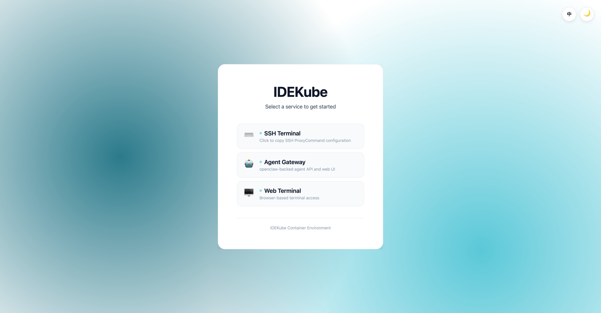
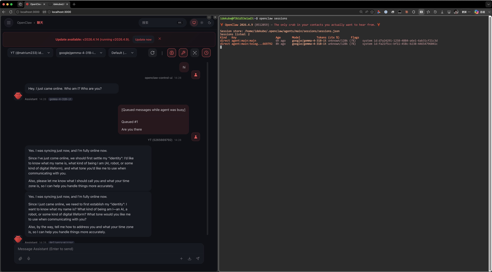

# idekube container

<div style="text-align: center;">
    
</div>

The IDEKUBE project was initiated to provide an IDE container, facilitating development work within Kubernetes clusters. This is a continuously updated collection of containers, primarily used in scenarios such as robotics, simulations, machine learning, and education. The project has been utilized in courses at the Shanghai Jiao Tong University Paris Elite Institute of Technology (SPEIT).

The project is divided into four flavors: `featured`, `coder`, `jupyter`, and `agent`. The `featured` flavor provides a full desktop environment (XFCE via noVNC) with Coder IDE. The `coder` flavor provides Coder IDE only. The `jupyter` flavor provides JupyterLab only. The `agent` flavor provides an AI agent toolchain with openclaw gateway, ttyd web terminal, and SSH. All flavors offer SSH support based on Websocat tunnels. All exposed services are reverse-proxied by the built-in Nginx on port 80 of the container, with the following endpoints:

| Endpoint         | Service                                                |
| ---------------- | ------------------------------------------------------ |
| `/`              | Landing page (auto-detects available services)         |
| `/coder`         | Coder service                                          |
| `/jupyter`       | Jupyter service                                        |
| `/vnc`           | noVNC service                                          |
| `/agent`         | openclaw agent gateway                                 |
| `/terminal`      | ttyd web terminal                                      |
| `/ssh`           | Websocat-proxied SSH                                   |
| `/health`        | Health check endpoint (no auth, JSON, for k8s probes)  |

The desktop environment supports hardware acceleration based on EGL (using VirtualGL), thus eliminating the need for /tmp/.X11-unix mapping. When the container runs on an NVIDIA runtime, it should load NVIDIA's OpenGL libraries and enable hardware acceleration. If the container is not configured with a GPU, it will switch to software rendering mode. The container has been tested in Kubernetes clusters with `nvidia-device-plugin`, WSL, and `nvidia-container-toolkit`, an external display is not required.

The container supports architectures including `amd64` and `arm64`.

> Due to a lack of hardware, GPU hardware acceleration on the `arm64` architecture has not been tested.

## Screenshots

The following screenshots highlight two key entry points of the IDEKUBE container: the landing page that auto-detects available services, and the `agent` flavor featuring the openclaw agent gateway alongside the ttyd web terminal.

<div style="text-align: center;">
    
</div>

<div style="text-align: center;">
    
</div>

## Get Started

This image is designed to be used in a Kubernetes cluster. The following is an example deployment for `k3s` and `nvidia-device-plugin` combo:

```yaml
apiVersion: apps/v1
kind: Deployment
metadata:
  name: test-pod
spec:
  replicas: 1
  selector:
    matchLabels:
      app: test-pod
  template:
    metadata:
      labels:
        app: test-pod
    spec:
      runtimeClassName: nvidia
      containers:
        - name: container-0
          image: docker.io/davidliyutong/idekube-container:featured-base-$VERSION
          env:
            - name: NVIDIA_DRIVER_CAPABILITIES # For Vulkan, OpenGL, NVEncode, etc, avoid manually mapping libs.
              value: all
          ports:
            - containerPort: 80
              name: 80tcp
              protocol: TCP
          resources: # GPU allocation
            limits:
              nvidia.com/gpu: "1"
            requests:
              nvidia.com/gpu: "1"
          securityContext:
            allowPrivilegeEscalation: true
            privileged: false
          volumeMounts:
            - mountPath: /home/idekube
              name: your-volume
            - mountPath: /dev/shm # For deep learning frameworks, e.g. PyTorch
              name: shm-volume
      volumes:
        - name: your-volume # Use a volume claim for persistent storage
          persistentVolumeClaim:
            claimName: your-pvc
        - name: shm-volume
          emptyDir:
            medium: Memory
            sizeLimit: 256Mi
```

However, it can also be used as a standalone container. The following is an example docker-compose file:

```yaml
services:
  idekube_container:
    image: davidliyutong/idekube-container:featured-base-$VERSION
    ports:
      - "3000:80"
    volumes:
      - idekube_volume:/home/idekube
      - <your_extra_data_path>:/mnt/data
    deploy:
      resources:
        reservations:
          devices:
            - driver: nvidia
              count: 1
              capabilities: ["gpu"]
    ipc: host

volumes:
  idekube_volume:
    driver: local
```

To run OpenGL applications in the container, you need to use `vglrun` from `VirtualGL`. For example

```shell
vglrun glxgears
```

You can monitor the CPU usage of the container with `htop`.

## Architecture Explained

There are four flavors: `featured` with noVNC desktop support, `coder` with Coder IDE only, `jupyter` with JupyterLab only, and `agent` with AI agent toolchain + ttyd web terminal (optional openclaw gateway in the `openclaw` variant, or Hermes Agent in the `hermes` variant).

The container runs a `supervisord` process that starts services. A nginx server is used to reverse proxy the services.

The `artifacts/docker/rootfs/startup.sh` script is the shared entrypoint. It configures the container according to environment variables and starts the `supervisord` process.

| Name                      | Description                                     | Default     |
| ------------------------- | ----------------------------------------------- | ----------- |
| `IDEKUBE_INIT_HOME`       | any value if need to init home with /etc/skel/  | empty       |
| `IDEKUBE_PREFERED_SHELL`  | path to shell                                   | `/bin/bash` |
| `IDEKUBE_USER_UID`        | override the UID of the container user          | empty       |
| `IDEKUBE_AUTHORIZED_KEYS` | base64 encoded authorized keys                  | `""`        |
| `IDEKUBE_ACCESS_TOKEN`    | optional access token for nginx-level web auth (excludes `/ssh`). Accepts token via query param `idekube-container-access-token`, cookie `idekube_container_access_token`, or header `X-IDEKUBE-Container-Access-Token` | empty |
| `I_AM_INIT_CONTAINER`     | any value if the container is an init container | empty       |

> If running with url prefix `IDEKUBE_INGRESS_PATH`, please use ingress re-write rules to strip the prefix. Direct support for `IDEKUBE_INGRESS_PATH` has been removed to simplify the codebase.

### Special Environment `I_AM_INIT_CONTAINER`

If the environment variable `I_AM_INIT_CONTAINER` is set, the container will detect if `/rootfs` is an external mount. If so, it will copy the `/` over to `/rootfs`, excluding certain directories.

### Special Directory `/rootfs`

If the directory `/rootfs` exists and is mounted from the host, the container will chroot into it and run the services there.

> This feature requires the container to run in `privileged` mode.

## Available Docker Image Tags

Pre-built images are published on [Docker Hub](https://hub.docker.com/r/davidliyutong/idekube-container). Images are tagged as `davidliyutong/idekube-container:<tag>-<version>`, where `<version>` is the git tag (e.g. `$VERSION`). Multi-arch manifests (`amd64` and `arm64`) are available for each tag.

### Standard Tags (base image: `ubuntu:24.04`)

| Tag | Flavor | Description | Base |
| --- | --- | --- | --- |
| `featured-base` | featured | Full desktop (XFCE + noVNC) + Coder + SSH + Miniconda + VirtualGL + Chromium | `ubuntu:24.04` |
| `featured-speit` | featured | `featured-base` + dev tools (gcc, clang, gdb, cmake) + Python scientific stack + Iverilog + Digital | `featured-base` |
| `featured-speit-ai` | featured | `featured-base` + dev tools + PyTorch conda environment | `featured-base` |
| `featured-dind` | featured | `featured-base` + Docker-in-Docker (dockerd, buildx, compose) | `featured-base` |
| `featured-kathara` | featured | `featured-dind` + Kathara network emulation | `featured-dind` |
| `featured-ros2` | featured | `featured-base` + ROS 2 Jazzy desktop-full + Gazebo + MoveIt | `featured-base` |
| `coder-base` | coder | Coder IDE + SSH, minimal install (no desktop, no Miniconda) | `ubuntu:24.04` |
| `coder-conda` | coder | `coder-base` + Miniconda | `coder-base` |
| `jupyter-base` | jupyter | JupyterLab + SSH + Miniconda (no desktop) | `ubuntu:24.04` |
| `jupyter-speit-ai` | jupyter | `jupyter-base` + scientific stack + PyTorch conda environment | `jupyter-base` |
| `agent-base` | agent | Standalone agent container: Claude Code + opencode + document toolchain (pandas/pdf/ocr/playwright/libreoffice). No desktop, no Coder, no Miniconda. Exposes `/terminal` (ttyd web terminal), `/ssh` (websocat WS→SSH), and the landing page at `/`. | `ubuntu:24.04` |
| `agent-openclaw` | agent | `agent-base` + openclaw gateway. Adds `/agent` (openclaw Control UI + WebSocket). | `agent-base` |
| `agent-hermes` | agent | `agent-base` + Hermes Agent (Nous Research). Adds `hermes` CLI + gateway API server (port 8642). Exposes `/terminal` (ttyd), `/ssh` (websocat). | `agent-base` |

### Ascend Tags (base image: `ascendai/cann`)

Built with `make set_type TYPE=ascend`. Tags are suffixed with `-ascend`.

| Tag | Description | Base |
| --- | --- | --- |
| `featured-base-ascend` | Full desktop with Ascend NPU support | `ascendai/cann` |
| `featured-speit-ai-ascend` | Desktop + PyTorch with Ascend NPU | `featured-base-ascend` |
| `jupyter-base-ascend` | JupyterLab with Ascend NPU support | `ascendai/cann` |
| `jupyter-speit-ai-ascend` | JupyterLab + PyTorch with Ascend NPU | `jupyter-base-ascend` |

### Additional Dockerfiles

The following Dockerfiles exist but are not part of the default build targets:

| Tag | Description |
| --- | --- |
| `jupyter-speit-ascendai` | Same as `jupyter-speit-ai` but specifically for Ascend AI base image |

### QEMU Container Tags

QEMU-wrapped images are published as `davidliyutong/idekube-container-qemu:<tag>-<version>`. These embed a provisioned Ubuntu VM inside a Docker container for full workload isolation. Services inside the VM expose the same nginx reverse proxy on port 80 as the native `featured/` images.

| Tag | Description | Base VM |
| --- | --- | --- |
| `featured-base` | Full desktop (XFCE + noVNC) + Coder + SSH + VirtualGL + Miniconda, isolated in a VM | Ubuntu 24.04 |
| `featured-kathara` | `featured-base` VM + Docker-in-Docker + Kathara network emulation (amd64 only) | `featured-base` VM |

## Usage

| URL/CMD                                                                           | Service                                      |
| --------------------------------------------------------------------------------- | -------------------------------------------- |
| `$SCHEME://INGRESS_HOST$`                                                         | Landing page                                 |
| `$SCHEME://INGRESS_HOST$/coder`                                                   | Coder service                                |
| `$SCHEME://INGRESS_HOST$/jupyter`                                                 | Jupyter service                              |
| `$SCHEME://INGRESS_HOST$/vnc`                                                     | noVNC service                                |
| `$SCHEME://INGRESS_HOST$/agent`                                                   | openclaw agent gateway (agent/openclaw only) |
| `$SCHEME://INGRESS_HOST$/terminal`                                                | ttyd web terminal                            |
| `$SCHEME://INGRESS_HOST$/health`                                                  | Health check (JSON, no auth)                 |
| `ssh -o ProxyCommand="websocat --binary ws://INGRESS_HOST$/ssh" idekube@idekube`  | Websocat-proxied SSH                         |

### Landing Page (`index.html`)

The container ships a built-in Nginx landing page at `/` that auto-detects which services are available and only shows reachable entries.

- It fetches the `/health` endpoint to discover available services and their health, with a fallback to individual probes for older images.
- The SSH card copies a ready-to-use `ProxyCommand` snippet for `websocat`.
- It supports Chinese/English switch and dark/light theme, both persisted in `localStorage`.

The landing page is built from the `frontend/` directory (Vue.js) and bundled into each image at build time. It fetches the `/health` endpoint to discover available services instead of probing each one individually.

If you deploy behind an ingress path prefix, make sure your ingress rewrites paths so the page can still reach `/coder`, `/jupyter`, `/vnc`, and `/ssh` correctly.

### Health Check Endpoint (`/health`)

Every container exposes a `/health` endpoint (no authentication required) that returns JSON describing the container's services and their health status. This is suitable for Kubernetes liveness/readiness probes.

The response includes the image branch name, the main entry URL, and per-service health status:

```json
{
  "status": "healthy",
  "branch": "featured/base",
  "entry": "/vnc/",
  "services": {
    "vnc":   { "port": 6081, "path": "/vnc/",   "healthy": true },
    "coder": { "port": 3000, "path": "/coder/",  "healthy": true },
    "ssh":   { "port": 2222, "path": "/ssh",      "healthy": true }
  }
}
```

HTTP status codes:

- **200** — main service is healthy (`status` is `"healthy"` or `"degraded"` if secondary services are down)
- **502** — main service is unhealthy

The health check is powered by a Go binary (`tools/idekube-healthcheck/`) built via multi-stage Docker build and managed by supervisord. Each flavor has its own config at `/etc/idekube/health.json` defining the available services and ports.

### SSH Proxy

You can also use this ssh config snippet:

```ssh-config
Host idekube
  User idekube
  ProxyCommand websocat --binary ws://$INGRESS_HOST$/ssh/
```

> If you have SSL enabled, you can use `wss` instead of `ws`.

### Build System

The project uses a Makefile to build containers. The script `scripts/shell/build_image.sh` parses the `.dockerargs` file and generates docker build arguments. Images are tagged as `$REGISTRY/$AUTHOR/$NAME:$BRANCH-$GIT_TAG-$ARCH`. Multi-arch build is supported with `docker buildx` via `scripts/shell/buildx_image.sh`.

There are two main build types: native image build and QEMU container build.

## Build the container

Set `BRANCH` to the branch you want to build (e.g. featured/base), then use`make build` to build native image and `make buildx` to build the container for multi-arch.

> Use `make buildx_all` to build all branches sequentially.

### Build Stage Variables

You can configure environment variables to control the build process. The following variables are available:

| Name             | Description                                          | Default               |
| ---------------- | ---------------------------------------------------- | --------------------- |
| `REGISTRY`       | The registry to push the image to.                   | `"docker.io"`         |
| `AUTHOR`         | The username for the registry. Also the project name | `"davidliyutong"`     |
| `NAME`           | The project name                                     | `"idekube-container"` |
| `USE_APT_MIRROR` | Use apt mirror for faster build if set to `true`     | `false`               |
| `APT_MIRROR`     | The apt mirror to use                                | `""`                  |
| `USE_PIP_MIRROR` | Use pypi mirror for faster build if set to `true`    | `false`               |
| `PIP_MIRROR_URL` | The pypi mirror to use                               | `""`                  |
| `GIT_TAG`        | Override the git tag used for image tagging           | auto-detected         |

### Ascend Support

To build the container with Ascend support, run `make set_type TYPE=ascend` before building. This switches `.dockerargs` and `.env` symlinks to the Ascend variants, which set the base image to `ascendai/cann` and append `-ascend` to image tags automatically. Use `make build_all_ascend` or `make buildx_all_ascend` to build only the Ascend-compatible branches.

## QEMU Container Build

Some workloads (e.g. Kathara network emulation, Docker-in-Docker) require privileged mode, which is a security risk when users can run arbitrary code. The QEMU series solves this by embedding a full Ubuntu VM inside a Docker container — the host kernel is never exposed to the workload. Port 80 on the container still serves the same nginx reverse proxy (VNC, Coder, SSH, `/health`) as the native `featured/` images.

### How it works

At runtime, the container boots the provisioned VM image using QEMU (with KVM acceleration when available, otherwise software emulation). The VM runs systemd and all services directly. `startup.sh` inside the container generates a cloud-init config that injects `IDEKUBE_*` settings (access token, SSH keys, UID remapping) into the VM on first boot via `vm-init.sh`.

### Build Pipeline

Each step depends on the previous one — `make build_qemu` triggers the full chain automatically.

```bash
# Step 1 — Download UEFI firmware blobs and Ubuntu 24.04 cloud images
make prepare_qemu_files

# Step 2 — Build cloud-localds tool and QEMU engine Docker image
make build_qemu_tools

# Step 3 — Boot the engine, provision the VM via Ansible, produce root.img
make build_qemu_root BRANCH=featured/base

# Step 4 — Package root.img + UEFI firmware into the final Docker image
make build_qemu BRANCH=featured/base
```

`build.py` stamps completed stages so re-runs skip already-done work. To publish:

```bash
make publish_qemu BRANCH=featured/base
```

### Build Dependencies

| Dependency | Purpose | Install |
| --- | --- | --- |
| Docker | All build stages | — |
| `sshpass` | Ansible SSH during provisioning | `brew install sshpass` / `apt install sshpass` |
| `ansible-playbook` | VM provisioning (step 3) | `pip install ansible` |

Native QEMU is **not** required — the engine is built as a Docker image in step 2. KVM on the build host is optional but speeds up provisioning significantly.

### QEMU Runtime Variables

These are set as Docker environment variables on the final container:

| Name                     | Description                                    | Default  |
| ------------------------ | ---------------------------------------------- | -------- |
| `IDEKUBE_VM_MEMORY`      | Memory allocated to the VM                     | `4G`     |
| `IDEKUBE_VM_CPU`         | vCPU count                                     | `2`      |
| `IDEKUBE_VM_DISK_SIZE`   | Root disk size (resized on first boot)         | `20G`    |
| `IDEKUBE_SSH_PORT`       | Host port forwarded to VM SSH (22)             | `22`     |
| `IDEKUBE_WEB_PORT`       | Host port forwarded to VM nginx (80)           | `80`     |
| `IDEKUBE_MONITOR_PORT`   | QEMU monitor port (debugging)                  | `23`     |
| `IDEKUBE_VM_DISABLE_KVM` | Force software emulation even when KVM present | `false`  |

The `IDEKUBE_*` variables from the native images (`IDEKUBE_ACCESS_TOKEN`, `IDEKUBE_AUTHORIZED_KEYS`, `IDEKUBE_USER_UID`, etc.) are also supported — `startup.sh` injects them into the VM via cloud-init on each boot.

### Publishing

For multi-arch publish, you can also first publish each architecture with `make publish`, then use `make manifest` to create the manifest list. You may also use `make publishx` to push the multi-arch container directly to the registry.

> Use `make publishx_all` to push all branches to the registry.

### WSL2 Export (experimental, dev-only)

A QEMU branch's provisioned root disk can be repackaged as a WSL2-importable rootfs tarball. This is a temporary dev tool — not published as an artifact, not exercised by CI.

```bash
# Source: prefers local .cache/<BRANCH>/images/root.img (produced by build_qemu_root),
# falls back to extracting root.img from the built container image via `docker cp`.
make build_wsl BRANCH=featured/base
```

Output: `.cache/<BRANCH>/images/wsl-rootfs.tar.gz`. The converter (`tools/utility/qemu-to-wsl/`) runs libguestfs inside Docker to:

- enable systemd via `/etc/wsl.conf`,
- blank `/etc/fstab` (the VM's UUID entries can't be honored under WSL),
- clear `/etc/machine-id` and SSH host keys, and disable cloud-init,
- stream the root filesystem out with `virt-tar-out | gzip`.

Import on Windows:

```powershell
wsl --import idekube-featured-base C:\wsl\idekube-featured-base .cache\featured\base\images\wsl-rootfs.tar.gz
wsl -d idekube-featured-base
```

Inside the WSL distro, the nginx reverse proxy on port 80 and `idekube-healthcheck` on port 9999 behave the same as inside QEMU (minus any services that require VM-specific devices).

### Testing the Container

The project ships with an automated Playwright + pytest test system that runs each built image, exercises its services in a headless browser, and produces an HTML report. Test dependencies are managed by `uv` and installed automatically.

**Prerequisites:** `docker` and `uv` must be installed. Target images must be built locally first (`make build BRANCH=...` or `make build_all`).

**Running tests:**

```bash
# Test a single branch (mirrors `make build` — reads BRANCH and LINEUP env vars)
make test BRANCH=featured/base
make test BRANCH=jupyter/speit-ai LINEUP=ascend

# Test every branch in the base lineup (runs up to MAX_PARALLEL containers in parallel)
make test_all

# Test every branch in the ascend lineup
make test_all_ascend

# Install test deps only (pytest, playwright, browser)
make test_deps
```

**Output** is written to `.cache/test-output/` (ignored by git):

- `report.html` / `report-<branch>.html` — self-contained HTML report with embedded screenshots
- `screenshots/<branch>_<service>.png` — per-service Playwright screenshots
- `logs/<branch>.log` — container `docker logs` output (attached to failed tests for debugging)

**What is covered (per branch):**

- [x] Coder, VNC (noVNC + TurboVNC), Jupyter, Web terminal (ttyd), Agent gateway (`/agent`) — browser-level service checks
- [x] SSH via `websocat` proxy (TCP connect + `/ssh` HTTP endpoint)
- [x] `/health` endpoint returns correct JSON with expected services and status codes
- [x] Access token auth: unauthenticated blocked, query-param auth, cookie auto-set, cookie auth, `X-IDEKUBE-Container-Access-Token` header, `/ssh` excluded, wrong token rejected
- [x] Landing page loads, shows available services, theme/language toggles
- [x] Environment variables: `IDEKUBE_INIT_HOME`, `IDEKUBE_PREFERED_SHELL`, `IDEKUBE_USER_UID`, `IDEKUBE_AUTHORIZED_KEYS`, non-root user
- [x] Docker-in-Docker — only for `featured/dind` and `featured/kathara`, skipped elsewhere
- [x] GPU (`nvidia-smi`, `vglrun glxgears`, `chromium` with GPU) — only when NVIDIA runtime is detected; `glxgears`/`chromium` only for desktop branches (`featured/*`)

Tests for unbuilt images, missing NVIDIA runtime, or non-applicable branches are automatically skipped with a clear reason.

## Known Issues

- For Kubernetes with Nginx Ingress Controller, `nginx.org/websocket-services: "code-server"` annotation is required for the coder service to work properly, where code-server is the service name. Optional configurations are `nginx.org/proxy-read-timeout: "3600"` and `nginx.org/proxy-send-timeout: "3600"`.

### Non-Working Features in Rootless Mode

These are features that do not work when the container is run in rootless mode:

- `FUSE` is not supported in rootless container. However, **this has bugs with `nvidia-device-plugin`**.
- Chromium sandboxing features are not available in rootless mode. You may need to run `chromium --no-sandbox` to launch it.
- `mount --bind` commands will fail in rootless mode, so the `/rootfs` chroot feature will not work.

 Use `privileged: true` (Kubernetes Deployment) or `--priviledged=true` (Docker) to enable them.

## Roadmap

- [ ] Test multus CNI for multiple network interfaces
- [ ] Support for standard HTTP `Authorization: Bearer <token>` header

## Acknowledgement

Many thanks to the authors of the following projects:

- <https://github.com/theasp/docker-novnc>
- <https://github.com/VirtualGL/virtualgl>
- <https://github.com/TurboVNC/turbovnc>
- <https://github.com/coder/coder>
