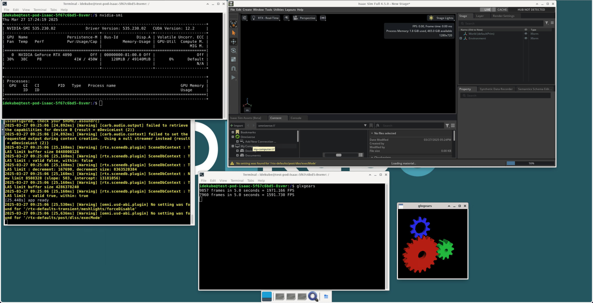

# idekube container

<div style="text-align: center;">
    
</div>
The IDEKUBE project was initiated to provide an IDE container, facilitating development work within Kubernetes clusters. This is a continuously updated collection of containers, primarily used in scenarios such as robotics, simulations, machine learning, and education. The project has been utilized in courses at the Shanghai Jiao Tong University Paris Elite Institute of Technology (SPEIT).

The project is divided into three flavors: `featured`, `coder`, and `jupyter`. The `featured` flavor provides a full desktop environment (XFCE via noVNC) with Coder IDE. The `coder` flavor provides Coder IDE only. The `jupyter` flavor provides JupyterLab only. All flavors offer SSH support based on Websocat tunnels. All exposed services are reverse-proxied by the built-in Nginx on port 80 of the container, with the following endpoints:

| Endpoint         | Service                  |
| ---------------- | ------------------------ |
| `/`              | Landing page (auto-detects available services) |
| `/coder`         | Coder service            |
| `/jupyter`       | Jupyter service          |
| `/vnc`           | noVNC service            |
| `/ssh`           | Websocat-proxied SSH     |

The desktop environment supports hardware acceleration based on EGL (using VirtualGL), thus eliminating the need for /tmp/.X11-unix mapping. When the container runs on an NVIDIA runtime, it should load NVIDIA's OpenGL libraries and enable hardware acceleration. If the container is not configured with a GPU, it will switch to software rendering mode. The container has been tested in Kubernetes clusters with `nvidia-device-plugin`, WSL, and `nvidia-container-toolkit`, an external display is not required.

The container supports architectures including `amd64` and `arm64`.

> Due to a lack of hardware, GPU hardware acceleration on the `arm64` architecture has not been tested.

## Get Started

This image is designed to be used in a Kubernetes cluster. The following is an example deployment for `k3s` and `nvidia-device-plugin` combo:

```yaml
apiVersion: apps/v1
kind: Deployment
metadata:
  name: test-pod
spec:
  replicas: 1
  selector:
    matchLabels:
      app: test-pod
  template:
    metadata:
      labels:
        app: test-pod
    spec:
      runtimeClassName: nvidia
      containers:
        - name: container-0
          image: docker.io/davidliyutong/idekube-container:featured-base-$VERSION
          env:
            - name: NVIDIA_DRIVER_CAPABILITIES # For Vulkan, OpenGL, NVEncode, etc, avoid manually mapping libs.
              value: all
          ports:
            - containerPort: 80
              name: 80tcp
              protocol: TCP
          resources: # GPU allocation
            limits:
              nvidia.com/gpu: "1"
            requests:
              nvidia.com/gpu: "1"
          securityContext:
            allowPrivilegeEscalation: true
            privileged: false
          volumeMounts:
            - mountPath: /home/idekube
              name: your-volume
            - mountPath: /dev/shm # For deep learning frameworks, e.g. PyTorch
              name: shm-volume
      volumes:
        - name: your-volume # Use a volume claim for persistent storage
          persistentVolumeClaim:
            claimName: your-pvc
        - name: shm-volume
          emptyDir:
            medium: Memory
            sizeLimit: 256Mi
```

However, it can also be used as a standalone container. The following is an example docker-compose file:

```yaml
services:
  idekube_container:
    image: davidliyutong/idekube-container:featured-base-$VERSION
    ports:
      - "3000:80"
    volumes:
      - idekube_volume:/home/idekube
      - <your_extra_data_path>:/mnt/data
    deploy:
      resources:
        reservations:
          devices:
            - driver: nvidia
              count: 1
              capabilities: ["gpu"]
    ipc: host

volumes:
  idekube_volume:
    driver: local
```

To run OpenGL applications in the container, you need to use `vglrun` from `VirtualGL`. For example

```shell
vglrun glxgears
```

You can monitor the CPU usage of the container with `htop`.

## Architecture Explained

There are three flavors: `featured` with noVNC desktop support, `coder` with Coder IDE only, and `jupyter` with JupyterLab only.

The container runs a `supervisord` process that starts services. A nginx server is used to reverse proxy the services.

The `artifacts/docker/startup-scripts/startup.sh` script is the shared entrypoint. It configures the container according to environment variables and starts the `supervisord` process.

| Name                      | Description                                     | Default     |
| ------------------------- | ----------------------------------------------- | ----------- |
| `IDEKUBE_INIT_HOME`       | any value if need to init home with /etc/skel/  | empty       |
| `IDEKUBE_PREFERED_SHELL`  | path to shell                                   | `/bin/bash` |
| `IDEKUBE_USER_UID`        | override the UID of the container user          | empty       |
| `IDEKUBE_AUTHORIZED_KEYS` | base64 encoded authorized keys                  | `""`        |
| `I_AM_INIT_CONTAINER`     | any value if the container is an init container | empty       |

> If running with url prefix `IDEKUBE_INGRESS_PATH`, please use ingress re-write rules to strip the prefix. Direct support for `IDEKUBE_INGRESS_PATH` has been removed to simplify the codebase.

### Special Environment `I_AM_INIT_CONTAINER`

If the environment variable `I_AM_INIT_CONTAINER` is set, the container will detect if `/rootfs` is an external mount. If so, it will copy the `/` over to `/rootfs`, excluding certain directories.

### Special Directory `/rootfs`

If the directory `/rootfs` exists and is mounted from the host, the container will chroot into it and run the services there.

> This feature requires the container to run in `privileged` mode.

## Available Docker Image Tags

Pre-built images are published on [Docker Hub](https://hub.docker.com/r/davidliyutong/idekube-container). Images are tagged as `davidliyutong/idekube-container:<tag>-<version>`, where `<version>` is the git tag (e.g. `$VERSION`). Multi-arch manifests (`amd64` and `arm64`) are available for each tag.

### Standard Tags (base image: `ubuntu:24.04`)

| Tag | Flavor | Description | Base |
| --- | --- | --- | --- |
| `featured-base` | featured | Full desktop (XFCE + noVNC) + Coder + SSH + Miniconda + VirtualGL + Chromium | `ubuntu:24.04` |
| `featured-speit` | featured | `featured-base` + dev tools (gcc, clang, gdb, cmake) + Python scientific stack + Iverilog + Digital | `featured-base` |
| `featured-speit-ai` | featured | `featured-base` + dev tools + PyTorch conda environment | `featured-base` |
| `featured-dind` | featured | `featured-base` + Docker-in-Docker (dockerd, buildx, compose) | `featured-base` |
| `featured-ros2` | featured | `featured-base` + ROS 2 Jazzy desktop-full + Gazebo + MoveIt | `featured-base` |
| `coder-base` | coder | Coder IDE + SSH + Miniconda (no desktop) | `ubuntu:24.04` |
| `coder-lite` | coder | Coder IDE + SSH, minimal install (no Miniconda, no VGL) | `ubuntu:24.04` |
| `jupyter-base` | jupyter | JupyterLab + SSH + Miniconda (no desktop) | `ubuntu:24.04` |
| `jupyter-speit-ai` | jupyter | `jupyter-base` + scientific stack + PyTorch conda environment | `jupyter-base` |
| `agent-base` | agent | Standalone agent container: openclaw gateway + Claude Code + opencode + document toolchain (pandas/pdf/ocr/playwright/libreoffice). No desktop, no Coder, no Miniconda. Exposes `/agent` (openclaw), `/ssh` (websocat WS→SSH), and the landing page at `/`. | `ubuntu:24.04` |

### Ascend Tags (base image: `ascendai/cann`)

Built with `make set_type TYPE=ascend`. Tags are suffixed with `-ascend`.

| Tag | Description | Base |
| --- | --- | --- |
| `featured-base-ascend` | Full desktop with Ascend NPU support | `ascendai/cann` |
| `featured-speit-ai-ascend` | Desktop + PyTorch with Ascend NPU | `featured-base-ascend` |
| `jupyter-base-ascend` | JupyterLab with Ascend NPU support | `ascendai/cann` |
| `jupyter-speit-ai-ascend` | JupyterLab + PyTorch with Ascend NPU | `jupyter-base-ascend` |

### Additional Dockerfiles

The following Dockerfiles exist but are not part of the default build targets:

| Tag | Description |
| --- | --- |
| `jupyter-speit-ascendai` | Same as `jupyter-speit-ai` but specifically for Ascend AI base image |

### QEMU Container Tags

QEMU-wrapped images are published as `davidliyutong/idekube-container-qemu:<tag>-<version>`. These run a lightweight VM inside the container for workload isolation.

## Usage

| URL/CMD                                                                           | Service              |
| --------------------------------------------------------------------------------- | -------------------- |
| `$SCHEME://INGRESS_HOST$`                                                         | Landing page         |
| `$SCHEME://INGRESS_HOST$/coder`                                                   | Coder service        |
| `$SCHEME://INGRESS_HOST$/jupyter`                                                 | Jupyter service      |
| `$SCHEME://INGRESS_HOST$/vnc`                                                     | noVNC service        |
| `ssh -o ProxyCommand="websocat --binary ws://INGRESS_HOST$/ssh" idekube@idekube`  | Websocat-proxied SSH |

### Landing Page (`index.html`)

The container ships a built-in Nginx landing page at `/` that auto-detects which services are available and only shows reachable entries.

- It probes `/coder`, `/jupyter`, `/vnc`, and checks WebSocket availability on `/ssh`.
- The SSH card copies a ready-to-use `ProxyCommand` snippet for `websocat`.
- It supports Chinese/English switch and dark/light theme, both persisted in `localStorage`.

Current landing-page files are:

- `artifacts/docker/coder/rootfs/usr/share/nginx/html/index.html`
- `artifacts/docker/jupyter/rootfs/usr/share/nginx/html/index.html`
- `artifacts/docker/featured/rootfs/usr/share/nginx/html/index.html`
- `artifacts/qemu/featured/rootfs/usr/share/nginx/html/index.html`

If you deploy behind an ingress path prefix, make sure your ingress rewrites paths so the page can still reach `/coder`, `/jupyter`, `/vnc`, and `/ssh` correctly.

### SSH Proxy

You can also use this ssh config snippet:

```ssh-config
Host idekube
  User idekube
  ProxyCommand websocat --binary ws://$INGRESS_HOST$/ssh/
```

> If you have SSL enabled, you can use `wss` instead of `ws`.

### Build System

The project uses a Makefile to build containers. The script `scripts/shell/build_image.sh` parses the `.dockerargs` file and generates docker build arguments. Images are tagged as `$REGISTRY/$AUTHOR/$NAME:$BRANCH-$GIT_TAG-$ARCH`. Multi-arch build is supported with `docker buildx` via `scripts/shell/buildx_image.sh`.

There are two main build types: native image build and QEMU container build.

## Build the container

Set `BRANCH` to the branch you want to build (e.g. featured/base), then use`make build` to build native image and `make buildx` to build the container for multi-arch.

> Use `make buildx_all` to build all branches sequentially.

### Build Stage Variables

You can configure environment variables to control the build process. The following variables are available:

| Name             | Description                                          | Default               |
| ---------------- | ---------------------------------------------------- | --------------------- |
| `REGISTRY`       | The registry to push the image to.                   | `"docker.io"`         |
| `AUTHOR`         | The username for the registry. Also the project name | `"davidliyutong"`     |
| `NAME`           | The project name                                     | `"idekube-container"` |
| `USE_APT_MIRROR` | Use apt mirror for faster build if set to `true`     | `false`               |
| `APT_MIRROR`     | The apt mirror to use                                | `""`                  |
| `USE_PIP_MIRROR` | Use pypi mirror for faster build if set to `true`    | `false`               |
| `PIP_MIRROR_URL` | The pypi mirror to use                               | `""`                  |
| `GIT_TAG`        | Override the git tag used for image tagging           | auto-detected         |

### Ascend Support

To build the container with Ascend support, run `make set_type TYPE=ascend` before building. This switches `.dockerargs` and `.env` symlinks to the Ascend variants, which set the base image to `ascendai/cann` and append `-ascend` to image tags automatically. Use `make build_all_ascend` or `make buildx_all_ascend` to build only the Ascend-compatible branches.

## QEMU Container Build

Certain applications, such as Kathara, requires the container to run in privileged mode. This is potentially dangerous if the user could run arbitrary code in the container. To mitigate this, a QEMU-based container is provided that runs a lightweight VM inside the container, isolating the host from the container.

To build the QEMU container, set the `BRANCH` variable to the desired branch (e.g. `featured/base`), then use `make build_qemu_root` to build the root disk for the VM, and `make build_qemu` to build the QEMU container image. You need to have `qemu-system-x86_64` or `qemu-system-aarch64` installed on your host machine, depending on the architecture you are building for.

> Use `make build_qemu_all` to build all branches sequentially.

### Dependencies

- QEMU >= 6.2
- sshpass (can be installed via `brew install sshpass` or `apt-get install sshpass`)

### QEMU Container Variables

| Name                     | Description                                  | Default |
| ------------------------ | -------------------------------------------- | ------- |
| `IDEKUBE_VM_MEMORY`      | Memory allocated to the QEMU VM              | `"2G"`  |
| `IDEKUBE_VM_CPU`         | Number of CPU cores allocated to the QEMU VM | `"2"`   |
| `IDEKUBE_VM_DISK_SIZE`   | Disk size for the QEMU VM root filesystem    | `"20G"` |
| `IDEKUBE_MONITOR_PORT`   | Expose QEMU monitor port from the VM         | `23`    |
| `IDEKUBE_SSH_PORT`       | Expose SSH port from the VM                  | `22`    |
| `IDEKUBE_WEB_PORT`       | Expose web services port from the VM         | `80`    |
| `IDEKUBE_VM_HEADLESS`    | Run the VM in headless mode                  | `true`  |
| `IDEKUBE_VM_DISABLE_KVM` | Disable KVM acceleration for the QEMU VM     | `false` |

### Publishing

For multi-arch publish, you can also first publish each architecture with `make publish`, then use `make manifest` to create the manifest list. You may also use `make publishx` to push the multi-arch container directly to the registry.

> Use `make publishx_all` to push all branches to the registry.

### Testing the Container

Here is a checklist for testing the container:

- [x] Coder is working
- [x] VNC is working, with `turbovnc` and `noVNC`, autocorrect resolution
- [x] Jupyter is working
- [x] SSH is working, with `websocat` proxy
- [x] `glxgears` is working
- [x] `chromium` is working, hardware acceleration is enabled
- [x] `nvidia-smi` is working
- [x] shell highlight is working
- [x] `dind` is working
- [x] Contaienr runs in the `nvidia` runtime class with GPU
- [x] Container runs without GPU
- [x] Container runs in the non-root user mode
- [x] IDEKUBE_INIT_HOME works

## Known Issues

- For Kubernetes with Nginx Ingress Controller, `nginx.org/websocket-services: "code-server"` annotation is required for the coder service to work properly, where code-server is the service name. Optional configurations are `nginx.org/proxy-read-timeout: "3600"` and `nginx.org/proxy-send-timeout: "3600"`.

### Non-Working Features in Rootless Mode

These are features that do not work when the container is run in rootless mode:

- `FUSE` is not supported in rootless container. However, **this has bugs with `nvidia-device-plugin`**.
- Chromium sandboxing features are not available in rootless mode. You may need to run `chromium --no-sandbox` to launch it.
- `mount --bind` commands will fail in rootless mode, so the `/rootfs` chroot feature will not work.

 Use `privileged: true` (Kubernetes Deployment) or `--priviledged=true` (Docker) to enable them.

## Roadmap

- [ ] Test multus CNI for multiple network interfaces
- [ ] Support for Authorization Header

## Acknowledgement

Many thanks to the authors of the following projects:

- <https://github.com/theasp/docker-novnc>
- <https://github.com/VirtualGL/virtualgl>
- <https://github.com/TurboVNC/turbovnc>
- <https://github.com/coder/coder>
